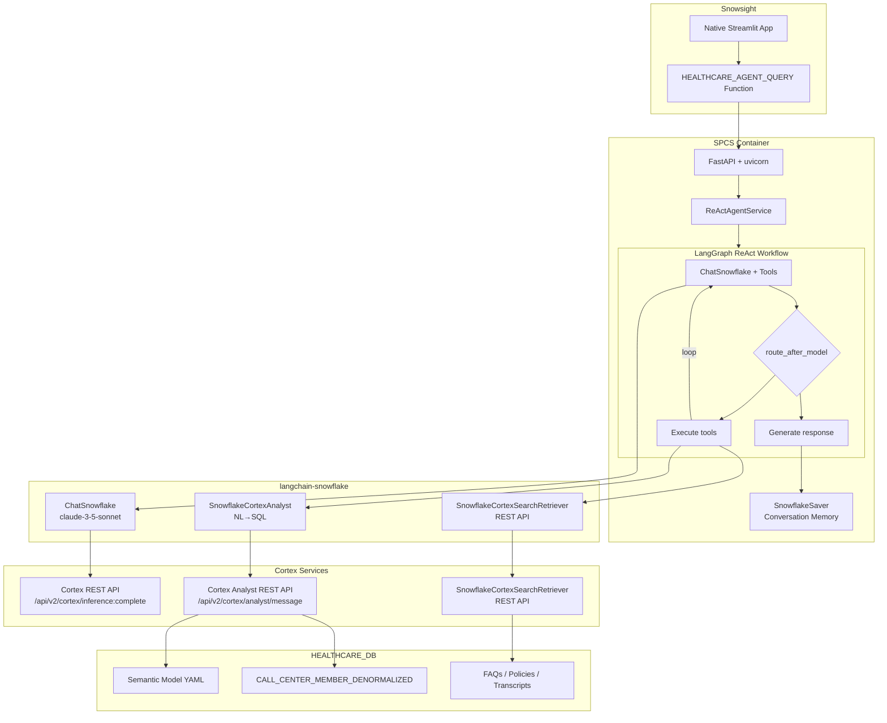

# Healthcare Contact Center ReAct Agent

An AI-powered healthcare contact center assistant built with **ReAct (Reasoning + Acting)** pattern using LangGraph on Snowflake SPCS.

---

## Executive Summary

### The Challenge

Contact centers are critical for healthcare payers, handling thousands of member inquiries daily. Agents need rapid access to:

- **Structured data**: Claims history, coverage details, member demographics
- **Unstructured knowledge**: Policies, FAQs, procedures, call transcripts
- **Audio context**: Transcribed call recordings for follow-up conversations

Traditional systems require agents to navigate multiple applications, causing delays and inconsistent service.

### The Solution

This lab builds a **production-ready AI assistant** using the **ReAct loop pattern**:

- **Native tool calling** via `langchain-snowflake` ChatSnowflake (claude-3-5-sonnet)
- **Intelligent tool selection** - automatic tool binding with `llm.bind_tools()`
- **Semantic model** for NL→SQL via `SnowflakeCortexAnalyst` REST API
- **Parallel search** via `SnowflakeCortexSearchRetriever` REST API across FAQs, Policies, and Transcripts
- **Conversation memory** persisted via Snowflake checkpointer
- **Fully async** orchestration via LangGraph with `asyncio.TaskGroup`

All within Snowflake's secure environment using official `langchain-snowflake` integration.

---

## Architecture

### ReAct Workflow



### LangGraph 


### ReAct Loop Example

```
User Query: "What claims does member 786924904 have, and what's the policy on appeals?"

┌─────────────────────────────────────────────────────────────────────┐
│ ITERATION 1                                                          │
├─────────────────────────────────────────────────────────────────────┤
│ Thought: User wants claims for a specific member AND policy info.    │
│          I should query member data first.                           │
│                                                                      │
│ Action: query_member_data                                            │
│ Action Input: {"query": "claims for member 786924904"}               │
│                                                                      │
│ Observation: Found 4 claims:                                         │
│   - Office Visit: $150 (approved)                                    │
│   - Lab Work: $275 (pending)                                         │
│   - Specialist: $450 (approved)                                      │
│   - Emergency: $1,200 (in review)                                    │
└─────────────────────────────────────────────────────────────────────┘

┌─────────────────────────────────────────────────────────────────────┐
│ ITERATION 2                                                          │
├─────────────────────────────────────────────────────────────────────┤
│ Thought: Now I have the claims. User also asked about appeal policy.│
│          I should search the knowledge base.                         │
│                                                                      │
│ Action: search_knowledge                                             │
│ Action Input: {"query": "claim appeal policy procedure"}             │
│                                                                      │
│ Observation: Found in FAQs:                                          │
│   "Appeals must be filed within 30 days of denial.                   │
│    Submit Form CA-101 with supporting documentation..."              │
└─────────────────────────────────────────────────────────────────────┘

┌─────────────────────────────────────────────────────────────────────┐
│ ITERATION 3                                                          │
├─────────────────────────────────────────────────────────────────────┤
│ Thought: I have both the claims data and appeal policy info.        │
│          I can now provide a complete answer.                        │
│                                                                      │
│ Action: FINAL_ANSWER                                                 │
│ Answer: "Member 786924904 has 4 claims on file:                      │
│          • Office Visit ($150) - Approved                            │
│          • Lab Work ($275) - Pending                                 │
│          • Specialist ($450) - Approved                              │
│          • Emergency ($1,200) - In Review                            │
│                                                                      │
│          Regarding appeals: You have 30 days from denial to file.    │
│          Use Form CA-101 with supporting documentation..."           │
└─────────────────────────────────────────────────────────────────────┘
```

### Database Schema

```
HEALTHCARE_DB
├── MEMBER_SCHEMA
│   ├── MEMBERS (member_id, dob, name, plan_id, status, address, phone) - 242 rows
│   ├── CLAIMS (claim_id, member_id, claim_date, service_type, amount, status) - 632 rows
│   ├── COVERAGE (plan_id, plan_name, deductible, copay_office, copay_er)
│   └── CALL_CENTER_MEMBER_DENORMALIZED (denormalized view for Cortex Analyst) - 632 rows
│
├── KNOWLEDGE_SCHEMA
│   ├── FAQS (faq_id, question, answer, category) - 4 rows
│   ├── POLICIES (policy_id, policy_name, content, version)
│   ├── CALL_TRANSCRIPTS (transcript_id, member_id, transcript_text, summary) - 32 rows
│   └── AUDIO_FILES (audio_id, call_recording_path, duration)
│
├── CHECKPOINT_SCHEMA (LangGraph State Persistence)
│   ├── LANGGRAPH_CHECKPOINTS
│   ├── LANGGRAPH_CHECKPOINT_BLOBS
│   ├── LANGGRAPH_CHECKPOINT_WRITES
│   └── LANGGRAPH_CHECKPOINT_MIGRATIONS
│
├── STAGING
│   ├── SEMANTIC_MODELS (Cortex Analyst semantic model YAML)
│   ├── HEALTHCARE_IMAGES (Docker image repository)
│   └── RAW_DATA (CSVs, PDFs)
│
└── Cortex Search Services
    ├── FAQS_SEARCH (on answer column)
    ├── POLICIES_SEARCH (on content column)
    └── TRANSCRIPTS_SEARCH (on transcript_text column)
```

---

## Project Structure

```
healthcare/
├── src/
│   ├── main.py                          # FastAPI app with lifespan
│   ├── config.py                        # pydantic-settings with SPCS detection
│   ├── dependencies.py                  # @lru_cache + Depends factories
│   ├── routers/
│   │   └── agent_routes.py              # /query, /stream, /sf-query endpoints
│   ├── graphs/
│   │   ├── react_state.py               # HealthcareReActState TypedDict
│   │   ├── react_workflow.py            # ReAct reasoning loop graph
│   │   ├── react_prompts.py             # System prompts + tool descriptions
│   │   └── react_parser.py              # LLM output parsing (orjson + fallbacks)
│   ├── models/
│   │   ├── requests.py                  # QueryRequest (member_id validation)
│   │   ├── responses.py                 # AgentResponse, StreamEvent
│   │   └── agent_types.py               # AnalystResultModel, SearchResultModel
│   ├── tools/
│   │   └── healthcare_tools.py          # @tool decorated functions (query_member_data, search_knowledge)
│   ├── otel_setup.py                    # OpenTelemetry initialization (auto-loaded)
│   └── services/
│       ├── react_agent_service.py       # AgentService.execute(), .stream()
│       ├── llm_service.py               # ChatSnowflake factory (langchain-snowflake)
│       ├── analyst_service.py           # SnowflakeCortexAnalyst factory
│       ├── search_service.py            # SnowflakeCortexSearchRetriever factory
│       ├── cortex_tools.py              # AsyncCortexAnalystTool, AsyncCortexSearchTool
│       ├── snowflake_checkpointer.py    # SQLAlchemy-based LangGraph checkpointer
│       └── snowflake_session.py         # SPCS token_file_path + resilient session wrapper
│
├── scripts/
│   ├── sql/
│   │   ├── 01_setup_db.sql              # Database, schemas, tables
│   │   ├── 02_checkpoint_schema.sql     # LangGraph checkpoint tables
│   │   ├── 03_load_data.sql             # Data loading
│   │   ├── 04_cortex_services.sql       # Cortex Search services
│   │   ├── 05_compute_resources.sql     # Compute pool, warehouse
│   │   ├── 08_spcs_deploy.sql           # SPCS deployment
│   │   ├── 09_semantic_model.sql        # Semantic model stage/upload
│   │   └── semantic_models/
│   │       └── healthcare_semantic_model.yaml  # Cortex Analyst NL→SQL model
│   └── streamlit/
│       └── payer_assistant.py           # Streamlit chat interface
│
├── tests/                               # tests
│   ├── conftest.py                      # ReAct-specific fixtures
│   ├── unit/
│   │   ├── test_models.py
│   │   └── test_snowflake_checkpointer.py
│   └── integration/
│       ├── test_agent_service.py
│       └── test_real_snowflake.py
│
├── patches/
│   ├── langchain-snowflake/                         # langchain-snowflake bug fixes
│   │   ├── langchain_snowflake_streaming_patched.py # ToolCallChunk for streaming
│   │   ├── langchain_snowflake_base_patched.py      # disable_streaming parameter
│   │   ├── langchain_snowflake_tools_patched.py     # Message format + tool name + inference metadata
│   │   ├── langchain_snowflake_utils_patched.py     # Response metadata for OTel attributes
│   │   └── langchain_snowflake_rest_client_patched.py # SNOWFLAKE_HOST fix
│   │
│   └── splunk-otel-python-contrib/                  # OpenTelemetry instrumentation patches
│       ├── callback_handler_patched.py              # Parent span linking, model extraction, Cortex Inference
│       ├── span_emitter_patched.py                  # Tool attributes, Snowflake metadata parsing
│       ├── types_patched.py                         # parent_span field for hierarchy
│       ├── attributes_patched.py                    # Snowflake Cortex attribute constants
│       ├── instruments_patched.py                   # Search score histogram, cost metrics
│       ├── metrics_patched.py                       # Cost metric recording with exemplars
│       ├── config_patched.py                        # Pricing configuration parsing
│       ├── environment_variables_patched.py         # Pricing environment variable definitions
│       ├── apply_patches.sh                         # Apply patches to .venv
│       ├── revert_patches.sh                        # Revert patches
│       └── README.md                                # Detailed patch documentation
│
├── streamlit/                           # Streamlit Container Runtime app
│   ├── app.py                           # SSE streaming + service function fallback
│   └── pyproject.toml                   # Container Runtime dependencies
│
├── pyproject.toml                       # Dependencies (Python 3.11)
├── langgraph.json                       # LangGraph config (react_healthcare only)
├── Dockerfile                           # Distroless multi-stage build (191MB)
├── .dockerignore                        # Excludes tests, docs, .venv from build context
└── README.md
```

---

## Features

| Feature | Description |
|---------|-------------|
| **Native Tool Calling** | `ChatSnowflake.bind_tools()` with automatic schema generation |
| **Langchain-snowflake** | Full integration with official Snowflake LangChain library |
| **Semantic Model** | NL→SQL via `SnowflakeCortexAnalyst` with verified queries |
| **Parallel Search** | `asyncio.TaskGroup` searches FAQs, Policies, Transcripts simultaneously |
| **Conversation Memory** | History persisted via Snowflake checkpointer for multi-turn context |
| **SPCS OAuth + Auto-Refresh** | Automatic token refresh via `token_file_path` when SPCS OAuth tokens expire |
| **Modern Error Handling** | Native LangGraph `RetryPolicy` with automatic retries (max 3 attempts) |
| **Token-Level Streaming** | Real-time LLM output + tool call progress via SSE (patched `langchain-snowflake`) |
| **Container Runtime** | Streamlit app runs on SPCS compute pool with internal DNS access |
| **OpenTelemetry Observability** | Full GenAI tracing with Snowflake Cortex Search metrics via `splunk-otel-python-contrib` |

---

## OpenTelemetry Observability

This project includes comprehensive **OpenTelemetry instrumentation** for LangChain/LangGraph applications using `splunk-otel-python-contrib` with custom patches for Snowflake Cortex Search observability.

### Telemetry Architecture

```
┌─────────────────────────────────────────────────────────────────────┐
│ Healthcare Agent (LangGraph)                                         │
├─────────────────────────────────────────────────────────────────────┤
│  splunk-otel-python-contrib                                          │
│  ├── LangChainInstrumentor (auto-instrumentation)                   │
│  ├── Traces: workflow → step → LLM/tool spans                       │
│  ├── Metrics: gen_ai.tool.search.score histogram                    │
│  └── Snowflake attributes: request_id, top_score, sources           │
└──────────────────────────┬──────────────────────────────────────────┘
                           │ OTLP (gRPC :4317)
                           ▼
┌─────────────────────────────────────────────────────────────────────┐
│ OpenTelemetry Collector                                              │
│  └── Exporters: Splunk Observability Cloud / Jaeger / etc.          │
└─────────────────────────────────────────────────────────────────────┘
```

### GenAI Span Attributes

The instrumentation captures rich telemetry following [OpenTelemetry GenAI Semantic Conventions](https://opentelemetry.io/docs/specs/semconv/gen-ai/):

| Attribute | Description | Example |
|-----------|-------------|---------|
| `gen_ai.request.model` | LLM model name | `claude-3-5-sonnet` |
| `gen_ai.response.model` | Response model | `claude-3-5-sonnet` |
| `gen_ai.provider.name` | LLM provider | `snowflake` |
| `gen_ai.tool.name` | Tool function name | `search_knowledge` |
| `gen_ai.tool.call.id` | Unique tool call ID | `tooluse_cJ0D_A...` |
| `gen_ai.tool.call.arguments` | Tool input (JSON) | `{"query": "..."}` |
| `gen_ai.tool.call.result` | Tool output | `[Knowledge Search] Found 9 results...` |

### Snowflake Cortex Search Attributes

Custom span attributes for Snowflake Cortex Search observability:

| Attribute | Description | Example |
|-----------|-------------|---------|
| `snowflake.cortex_search.request_id` | Snowflake API request ID | `e14a3c0c-c258-...` |
| `snowflake.cortex_search.top_score` | Top cosine similarity score | `0.446` |
| `snowflake.cortex_search.result_count` | Number of search results | `9` |
| `snowflake.cortex_search.sources` | Search sources queried | `transcripts` |
| `snowflake.database` | Snowflake database context | `HEALTHCARE_DB` |
| `snowflake.schema` | Snowflake schema context | `KNOWLEDGE_SCHEMA` |
| `snowflake.warehouse` | Snowflake warehouse context | `PAYERS_CC_WH` |

### Snowflake Cortex Analyst Attributes

Custom span attributes for Snowflake Cortex Analyst (NL→SQL) observability:

| Attribute | Description | Example |
|-----------|-------------|---------|
| `snowflake.database` | Snowflake database | `HEALTHCARE_DB` |
| `snowflake.schema` | Snowflake schema | `PUBLIC` |
| `snowflake.warehouse` | Snowflake warehouse | `PAYERS_CC_WH` |
| `cortex_analyst.semantic_model.name` | Semantic model path | `@HEALTHCARE_DB.STAGING/.../model.yaml` |
| `cortex_analyst.semantic_model.type` | Model type | `FILE_ON_STAGE` |
| `cortex_analyst.request_id` | Snowflake request ID | `4867f778-d2da-...` |
| `cortex_analyst.sql` | Generated SQL query | `SELECT * FROM...` |
| `cortex_analyst.model_names` | LLM models used | `['claude-4-sonnet']` |
| `cortex_analyst.question_category` | Query classification | `CLEAR_SQL` |
| `cortex_analyst.verified_query.name` | Matched VQR name | `member_details` |
| `cortex_analyst.verified_query.question` | VQR question | `Tell me about member...` |
| `cortex_analyst.verified_query.sql` | VQR SQL template | `SELECT DISTINCT...` |
| `cortex_analyst.verified_query.verified_at` | VQR verification timestamp | `1734739200` |
| `cortex_analyst.verified_query.verified_by` | VQR verifier | `system` |
| `cortex_analyst.warnings_count` | Number of warnings | `0` |

### Snowflake Cortex Inference Attributes

Attributes for LLM completion calls via `/api/v2/cortex/inference:complete`:

| Attribute | Description | Example |
|-----------|-------------|---------|
| `gen_ai.response.id` | Snowflake response ID (OTel GenAI semconv) | `1855de73-2d56-...` |
| `gen_ai.response.finish_reasons` | Completion finish reasons (OTel GenAI semconv) | `["stop"]` |
| `snowflake.inference.guard_tokens` | Guard tokens consumed | `15` |
| `snowflake.database` | Session database context | `HEALTHCARE_DB` |
| `snowflake.schema` | Session schema context | `PUBLIC` |
| `snowflake.warehouse` | Session warehouse context | `PAYERS_CC_WH` |

### Search Quality Metric

A histogram metric `gen_ai.tool.search.score` tracks search relevance with pre-configured bucket boundaries for cosine similarity (0.0-1.0):

```
Name: gen_ai.tool.search.score
Dimensions:
  - gen_ai.tool.name: search_knowledge
  - gen_ai.provider.name: snowflake
  - snowflake.cortex_search.sources: transcripts
Buckets: [0.0, 0.1, 0.2, 0.3, 0.4, 0.5, 0.6, 0.7, 0.8, 0.9, 1.0]
```

This enables:
- **Alerting** on low search quality (p50/p95 < threshold)
- **Trending** search relevance over time
- **Correlation** with user satisfaction metrics

### Snowflake Cortex Cost Metrics

Automatic cost estimation metrics for Snowflake Cortex services:

| Metric | Type | Unit | Description |
|--------|------|------|-------------|
| `snowflake.cortex_analyst.messages` | Counter | `{message}` | Messages processed by Cortex Analyst |
| `snowflake.cortex_search.queries` | Counter | `{query}` | Queries processed by Cortex Search |
| `snowflake.cortex.credits` | Counter | `{credit}` | Total Snowflake credits consumed |
| `snowflake.cortex.cost` | Counter | `USD` | Estimated cost in USD |

**Pricing Configuration** (via environment variables):

| Variable | Default | Description |
|----------|---------|-------------|
| `OTEL_SNOWFLAKE_CORTEX_ANALYST_CREDITS_PER_MESSAGE` | `0.067` | Credits per Analyst message |
| `OTEL_SNOWFLAKE_CORTEX_SEARCH_CREDITS_PER_1000_QUERIES` | `1.7` | Credits per 1000 Search queries |
| `OTEL_SNOWFLAKE_CREDIT_PRICE_USD` | `3.00` | USD price per Snowflake credit |

Adjust these values based on your Snowflake contract pricing.

### Trace Hierarchy

Proper parent-child span linking shows the full ReAct workflow:

```
workflow react_healthcare (trace root)
├── step model
│   └── LLM claude-3-5-sonnet
├── step tools
│   └── tool search_knowledge          ← Snowflake attributes here
└── step model
    └── LLM claude-3-5-sonnet
```

### Setup

1. **Install instrumentation** (included in `pyproject.toml`):
   ```bash
   pip install splunk-otel-python-contrib
   ```

2. **Apply Snowflake patches** (for Cortex Search observability):
   ```bash
   cd patches/splunk-otel-python-contrib
   ./apply_patches.sh /path/to/.venv
   ```

3. **Configure environment**:
   ```env
   OTEL_SERVICE_NAME=healthcare-agent
   OTEL_EXPORTER_OTLP_ENDPOINT=http://your-collector:4317
   OTEL_EXPORTER_OTLP_PROTOCOL=grpc
   ```

4. **OTel is auto-initialized** via `src/otel_setup.py` on application startup.

### Patches for splunk-otel-python-contrib

We contributed patches to fix issues with LangChain/LangGraph instrumentation:

| Fix | Description |
|-----|-------------|
| Parent-child span linking | Proper trace hierarchy for LangGraph workflows |
| Model name extraction | `gen_ai.request.model` for ChatSnowflake |
| Tool call ID extraction | `gen_ai.tool.call.id` from LangGraph ToolNode |
| Provider inheritance | `gen_ai.provider.name` propagated to tool spans |
| Cortex Search attributes | Request ID, scores, sources, connection context |
| Cortex Analyst attributes | Semantic model, SQL, VQR, question category |
| Cortex Inference attributes | `gen_ai.response.id`, finish reasons, guard tokens |
| Streaming token usage | Token counts from `usage_metadata` in streaming responses |
| Search score histogram | Pre-configured buckets for cosine similarity (0.0-1.0) |
| Cost metrics | Credits, messages, queries, USD cost estimation |
| Pricing configuration | Environment variables for custom Snowflake pricing |

**Patched Files:**
- `callback_handler_patched.py` - Parent span linking, model extraction, Cortex Inference, streaming token usage
- `span_emitter_patched.py` - Tool attributes, Snowflake metadata parsing
- `types_patched.py` - `parent_span` field for hierarchy
- `attributes_patched.py` - Snowflake Cortex attribute constants
- `instruments_patched.py` - Search score histogram, cost metrics
- `metrics_patched.py` - Cost metric recording with exemplars
- `config_patched.py` - Pricing configuration parsing
- `environment_variables_patched.py` - Pricing environment variable definitions

See `patches/splunk-otel-python-contrib/README.md` for full details.

---

## Streamlit UI


### Streaming Mode

The Streamlit app supports **real-time SSE streaming** when running on Container Runtime:

- **Enable streaming progress** toggle shows live tool execution status
- Real-time events: `🤔 Thinking...` → `📊 Calling tool` → `📥 Results` → `✅ Answer`
- Full `analystResults` and `searchResults` returned in streaming mode
- Fallback to synchronous service function if streaming unavailable

### Container Runtime vs Warehouse Runtime

| Feature | Container Runtime | Warehouse Runtime |
|---------|------------------|-------------------|
| **Compute** | SPCS Compute Pool | Virtual Warehouse |
| **Network** | Internal DNS access | External only |
| **Streaming** | ✅ SSE via `/agents/stream` | ❌ Service function only |
| **Dependencies** | `pyproject.toml` | `environment.yml` |


---

## Technology Stack

| Layer | Component | Purpose |
|-------|-----------|---------|
| **Frontend** | Streamlit | Chat interface with session memory |
| **API** | FastAPI + uvicorn | Async HTTP endpoints |
| **Orchestration** | LangGraph | ReAct state graph with checkpointing |
| **LLM Integration** | langchain-snowflake | `ChatSnowflake` + `SnowflakeCortexAnalyst` |
| **Reasoning** | claude-3-5-sonnet | Anthropic model via Cortex REST API |
| **Structured Data** | Cortex Analyst API | NL→SQL via semantic model |
| **Unstructured Data** | Cortex Search | FAQs, policies, call transcripts |
| **Validation** | Pydantic v2 | Request/response models |
| **Observability** | splunk-otel-python-contrib | OpenTelemetry GenAI tracing + metrics |
| **Deployment** | SPCS | Snowflake Container Services (Distroless) |

---

## Getting Started

### Prerequisites

- Snowflake account with Cortex services enabled
- Python 3.11+ with `uv` package manager
- Key-pair Snowflake authentication configured
- Snow CLI configured

### Quick Start

```bash
# Clone and navigate to project
cd /path/to/healthcare

# Install dependencies
uv sync --group dev

# Run SQL setup scripts
snow sql -c <your_connection_name> --filename scripts/sql/01_setup_db.sql
snow sql -c <your_connection_name> --filename scripts/sql/02_checkpoint_schema.sql
# ... continue with remaining scripts

# Upload semantic model
snow sql -c <your_connection_name> --filename scripts/sql/09_semantic_model.sql
# PUT file to @STAGING.SEMANTIC_MODELS

# Start LangGraph dev server
langgraph dev --port 8123

# Run tests (79 tests)
poetry run pytest tests/ -v

# Start FastAPI server locally
uvicorn src.main:app --reload
```

### Environment Variables

Create `.env` file:

```env
# Snowflake Connection
SNOWFLAKE_ACCOUNT=your_account
SNOWFLAKE_USER=your_user
SNOWFLAKE_PRIVATE_KEY_PATH=/path/to/rsa_key.p8
SNOWFLAKE_PRIVATE_KEY_PASSPHRASE=your_passphrase
SNOWFLAKE_DATABASE=HEALTHCARE_DB
SNOWFLAKE_WAREHOUSE=PAYERS_CC_WH
SNOWFLAKE_ROLE=ACCOUNTADMIN

# OpenTelemetry (optional - enables observability)
OTEL_SERVICE_NAME=healthcare-agent
OTEL_EXPORTER_OTLP_ENDPOINT=http://your-otel-collector:4317
OTEL_EXPORTER_OTLP_PROTOCOL=grpc

# Snowflake Cortex Cost Estimation (optional - for cost metrics)
OTEL_SNOWFLAKE_CORTEX_ANALYST_CREDITS_PER_MESSAGE=0.067
OTEL_SNOWFLAKE_CORTEX_SEARCH_CREDITS_PER_1000_QUERIES=1.7
OTEL_SNOWFLAKE_CREDIT_PRICE_USD=3.00
```

### SPCS Deployment

```bash
# Build Docker image for linux/amd64 (Distroless)
VERSION=1.0.100
docker buildx build --platform linux/amd64 -t healthcare-agent:$VERSION .

# Tag and push to Snowflake registry
REGISTRY="your-account.registry.snowflakecomputing.com"
docker tag healthcare-agent:$VERSION ${REGISTRY}/healthcare_db/staging/healthcare_images/healthcare-agent:$VERSION
snow spcs image-registry login -c <your_connection_name>
docker push ${REGISTRY}/healthcare_db/staging/healthcare_images/healthcare-agent:$VERSION

# Deploy service
snow sql -c <your_connection_name> --filename scripts/sql/08_spcs_deploy.sql
```

> **langchain-snowflake Patches (applied in Dockerfile):**
> 
> We discovered and fixed **3 critical bugs** in `langchain-snowflake` that break multi-turn conversations with tools:
> 
> | Patch | Bug Fixed | Impact |
> |-------|-----------|--------|
> | `streaming_patched.py` | Tool call deltas silently dropped | Streaming fails with tools |
> | `tools_patched.py` | Text in `content_list` instead of top-level `content` | 400 errors on turn 3+ |
> | `tools_patched.py` | Tool name defaults to "unknown" | Debugging difficulty |
> | `base_patched.py` | No `disable_streaming` parameter | Can't control streaming |
> | `rest_client.py` | `SNOWFLAKE_HOST` not used in SPCS | OAuth auth failures |
> 
> See `langchain_snowflake_*_bug.md` files for detailed bug reports.

### Test SPCS Service

```sql
-- Simple query
SELECT STAGING.HEALTHCARE_AGENT_QUERY('How many members do we have?', NULL, 'test_1');

-- Member-specific query
SELECT STAGING.HEALTHCARE_AGENT_QUERY('Tell me about member 786924904', '786924904', 'test_2');

-- Knowledge search
SELECT STAGING.HEALTHCARE_AGENT_QUERY('What is the policy for prescription coverage?', NULL, 'test_3');
```

---

## References

### Original Lab Resources

- **Snowflake QuickStart Guide**: [AI Agent for Health Payers Contact Center](https://quickstarts.snowflake.com/guide/ai_agent_health_payers_cc/index.html)
- **Video Walkthrough**: [YouTube - Healthcare AI Agent Demo](https://youtu.be/UXge7Vv8uSg?si=aWw2GcnCfWRMVzUE)

### Core Technologies

- [LangGraph Documentation](https://langchain-ai.github.io/langgraph/)
- [langchain-snowflake](https://github.com/langchain-ai/langchain-snowflake) - Official Snowflake LangChain integration
- [Snowflake Cortex Analyst](https://docs.snowflake.com/en/user-guide/snowflake-cortex/cortex-analyst)
- [Snowflake Cortex Search](https://docs.snowflake.com/en/user-guide/snowflake-cortex/cortex-search)
- [Snowflake Container Services (SPCS)](https://docs.snowflake.com/en/developer-guide/snowpark-container-services/overview)

### Observability

- [OpenTelemetry GenAI Semantic Conventions](https://opentelemetry.io/docs/specs/semconv/gen-ai/)
- [splunk-otel-python-contrib](https://github.com/signalfx/splunk-otel-python-contrib) - Splunk OpenTelemetry Python contributions
- [OpenTelemetry Python](https://opentelemetry.io/docs/languages/python/)

---

## License

MIT License - See LICENSE file for details.
