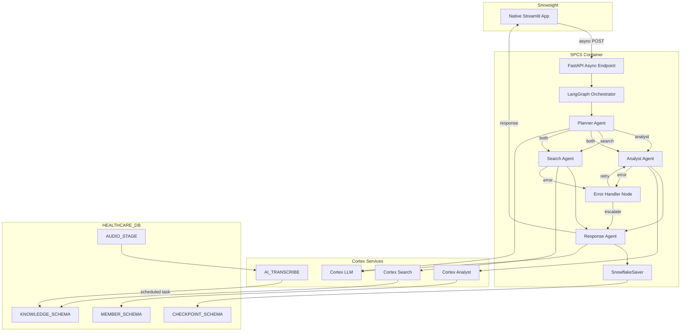

# Healthcare Contact Center Multi-Agent Lab

An AI-powered healthcare contact center assistant built with LangGraph multi-agent orchestration on Snowflake.

---

## Executive Summary

### The Challenge

Contact centers are critical for healthcare payers, handling thousands of member inquiries daily. Agents need rapid access to:

- **Structured data**: Claims history, coverage details, member demographics
- **Unstructured knowledge**: Policies, FAQs, procedures, call transcripts
- **Audio context**: Transcribed call recordings for follow-up conversations

Traditional systems require agents to navigate multiple applications, causing delays and inconsistent service.

### The Solution

This lab builds a **production-ready AI assistant** that combines:

- **Intelligent routing** via Planner Agent to appropriate data sources
- **Structured queries** via Cortex Analyst (member, claims, coverage)
- **Semantic search** via Cortex Search (policies, FAQs, transcripts)
- **Audio transcription** via AI_TRANSCRIBE for call recordings
- **Async orchestration** via LangGraph with parallel agent execution

All within Snowflake's secure environment—no external API calls required.

---

## Architecture

### System Architecture



### Data Flow Example

```
Contact Center Agent Question:
"What are the recent claims for member DOB 1985-03-15, and what's our policy on claim appeals?"

                        ↓
                   PLANNER
                   └─ Decides: Use BOTH Analyst (for claims) + Search (for policy)

            ┌─────────────────────────┐
            ▼                         ▼
       ANALYST                    SEARCH
       └─ Cortex Analyst          └─ Cortex Search
          Query: SELECT claims       Query: "claim appeal policy"
          FOR member DOB...          RESULT: Policy docs + FAQ chunks
          RESULT: 3 recent claims    (relevance scores 0.91, 0.87)

            └────────────┬────────────┘
                         ▼
                  RESPONSE GENERATION
                  "Member has 3 claims:
                   • Hospitalization: $2,500 (approved)
                   • ER visit: $450 (approved)
                   • Lab work: $125 (pending)
                   
                   Regarding appeals: Our policy allows 30 days
                   from denial notice. Submit form X to..."
                   
                   [Sources: Policy Doc v2.1, FAQ #45]

                         ↓
                   CONTACT CENTER AGENT
                   Gets instant answer to help member
```

### Database Schema

```
HEALTHCARE_DB
├── MEMBER_SCHEMA
│   ├── MEMBERS (member_id, dob, name, plan_id, status, address, phone)
│   ├── CLAIMS (claim_id, member_id, claim_date, service_type, amount, status)
│   └── COVERAGE (plan_id, plan_name, deductible, copay_office, copay_er)
│
├── KNOWLEDGE_SCHEMA
│   ├── FAQS (faq_id, question, answer, category, updated_date)
│   ├── POLICIES (policy_id, policy_name, content, version, effective_date)
│   ├── CALL_TRANSCRIPTS (transcript_id, member_id, call_date, transcript_text, summary, sentiment)
│   ├── AUDIO_FILES (audio_id, call_recording_path, member_id, duration, uploaded_date)
│   ├── CALLER_INTENT_TRAIN_DATASET (training data for caller intent prediction)
│   └── CALLER_INTENT_PREDICT_DATASET (prediction data)
│
├── CHECKPOINT_SCHEMA (LangGraph State Persistence)
│   ├── LANGGRAPH_CHECKPOINTS
│   ├── LANGGRAPH_CHECKPOINT_BLOBS
│   ├── LANGGRAPH_CHECKPOINT_WRITES
│   └── LANGGRAPH_CHECKPOINT_MIGRATIONS
│
├── STAGING
│   ├── AUDIO_STAGE_SSE (MP3/WAV files - SSE encrypted for AI_TRANSCRIBE)
│   └── RAW_DATA_SSE (CSVs, PDFs - SSE encrypted for PARSE_DOCUMENT)
│
└── Cortex Services
    ├── FAQS_SEARCH (semantic search on FAQ answer column)
    ├── POLICIES_SEARCH (semantic search on policy content)
    ├── TRANSCRIPTS_SEARCH (semantic search on call transcripts)
    └── MEMBER_SEMANTIC_MODEL (Cortex Analyst for structured queries)
```

---

## Project Structure

```
healthcare/
├── src/
│   ├── __init__.py
│   ├── main.py                          # FastAPI app with lifespan context manager
│   ├── config.py                        # pydantic-settings BaseSettings
│   ├── dependencies.py                  # @lru_cache + Depends factories
│   ├── exceptions.py                    # Custom exceptions + global handler
│   ├── routers/
│   │   └── agent_routes.py              # /query, /stream endpoints (RORO pattern)
│   ├── graphs/
│   │   ├── state.py                     # TypedDict with reducers + error tracking
│   │   └── workflow.py                  # StateGraph with asyncio.TaskGroup
│   ├── models/
│   │   ├── base.py                      # BaseSchema with ConfigDict
│   │   ├── requests.py                  # QueryRequest, StreamRequest
│   │   ├── responses.py                 # AgentResponse, StreamEvent
│   │   └── agent_types.py               # AnalystResult, SearchResult, ErrorDetail
│   ├── services/
│   │   ├── agent_service.py             # AgentService.execute(), .stream()
│   │   ├── cortex_tools.py              # AsyncCortexAnalystTool, AsyncCortexSearchTool
│   │   └── checkpointer.py              # AsyncSnowflakeSaver setup
│   └── middleware/
│       └── logging.py                   # Request ID middleware
│
├── notebooks/
│   ├── healthcare_agents.ipynb          # Development notebook
│   ├── payer_setup.ipynb                # Original data setup
│   └── data/
│       ├── DATA_PRODUCT/                # Member/claims CSVs
│       ├── CALLER_INTENT/               # Caller intent training data
│       ├── FAQS/                        # Enterprise_NXT FAQ PDFs
│       └── CALL_RECORDINGS/             # MP3 audio files
│
├── tests/
│   ├── conftest.py                      # Fixtures
│   ├── unit/                            # Unit tests
│   └── integration/                     # Integration tests
│
├── scripts/
│   ├── streamlit/                       # Original Streamlit assets
│   └── sql/
│       ├── 01_setup_db.sql              # Database, schemas, tables
│       ├── 02_checkpoint_schema.sql     # LangGraph checkpoint tables
│       ├── 03_load_data.sql             # CSV/PDF/MP3 data loading
│       ├── 04_cortex_services.sql       # Cortex Search services
│       ├── 05_compute_resources.sql     # Compute pool, warehouse
│       ├── 06_audio_task.sql            # AI_TRANSCRIBE scheduled task
│       └── 07_deploy_streamlit.sql      # Streamlit deployment
│
├── streamlit/
│   └── app.py                           # Multi-agent chat interface
│
├── pyproject.toml                       # uv dependency management
├── uv.lock                              # Locked dependencies
├── langgraph.json                       # LangGraph CLI config
├── Dockerfile                           # SPCS container with uv
├── .env                                 # Environment variables
└── README.md
```

---

## Features

| Feature | Description |
|---------|-------------|
| **Intelligent Routing** | Planner Agent decides which agents (Analyst, Search, or both) to invoke based on query intent |
| **Parallel Execution** | Analyst and Search agents run concurrently via `asyncio.TaskGroup` |
| **Hybrid Data Access** | Combines structured queries (Cortex Analyst) + semantic search (Cortex Search) |
| **Audio Processing** | AI_TRANSCRIBE scheduled task processes call recordings with speaker diarization |
| **Circuit Breaker** | Error handling with retry/escalate logic and max step limits |
| **State Persistence** | AsyncSnowflakeSaver checkpoints conversation state to Snowflake |
| **Streaming Responses** | SSE endpoint for real-time agent execution updates |
| **Multi-tenant** | Thread scoping with `tenant:user:timestamp` format |

---

## Technology Stack

| Layer | Component | Purpose |
|-------|-----------|---------|
| **Frontend** | Streamlit | Chat interface with session memory |
| **API** | FastAPI + uvicorn | Async HTTP endpoints |
| **Orchestration** | LangGraph | Multi-agent state graph with checkpointing |
| **Structured Data** | Cortex Analyst | SQL generation via semantic model |
| **Unstructured Data** | Cortex Search | Semantic search (FAQs, policies, transcripts) |
| **Audio Processing** | AI_TRANSCRIBE | Call transcription with summarization |
| **Validation** | Pydantic v2 | Request/response models with strict typing |
| **Deployment** | SPCS | Snowflake Container Services |

---

## Getting Started

### Prerequisites

- Snowflake account with Cortex services enabled
- Python 3.11+ with `uv` package manager
- Key-pair Snwoflake authentication configured
- Snow cli is configured

### Quick Start

```bash
# Clone and navigate to project
cd /path/to/healthcare

# Install dependencies
uv sync --group dev

# Run SQL setup scripts (in order)
snow sql -c jwt --filename scripts/sql/01_setup_db.sql
snow sql -c jwt --filename scripts/sql/02_checkpoint_schema.sql
# ... (see impl_plan_final.md for data loading steps)

# Start LangGraph Studio for local development
uv run langgraph dev

# Run tests
uv run pytest tests/ -v

# Start FastAPI server
uv run uvicorn src.main:app --reload
```

### Environment Variables

Create `.env` file with:

```env
SNOWFLAKE_ACCOUNT=your_account
SNOWFLAKE_USER=your_user
SNOWFLAKE_PRIVATE_KEY_PATH=/path/to/rsa_key.p8
SNOWFLAKE_PRIVATE_KEY_PASSPHRASE=your_passphrase
SNOWFLAKE_DATABASE=HEALTHCARE_DB
SNOWFLAKE_WAREHOUSE=PAYERS_CC_WH
SNOWFLAKE_ROLE=ACCOUNTADMIN
```

---

## References

### Original Lab Resources

- **Snowflake QuickStart Guide**: [AI Agent for Health Payers Contact Center](https://quickstarts.snowflake.com/guide/ai_agent_health_payers_cc/index.html)
- **Snowflake HCLS Guide**: [AI Agent Health Payers CC](https://www.snowflake.com/en/developers/guides/ai-agent-health-payers-cc/)
- **Video Walkthrough**: [YouTube - Healthcare AI Agent Demo](https://youtu.be/UXge7Vv8uSg?si=aWw2GcnCfWRMVzUE)

### Core Technologies

- [LangGraph Documentation](https://langchain-ai.github.io/langgraph/)
- [Snowflake Cortex Analyst](https://docs.snowflake.com/en/user-guide/snowflake-cortex/cortex-analyst)
- [Snowflake Cortex Search](https://docs.snowflake.com/en/user-guide/snowflake-cortex/cortex-search)
- [Snowflake Container Services (SPCS)](https://docs.snowflake.com/en/developer-guide/snowpark-container-services/overview)
- [AI_TRANSCRIBE Function](https://docs.snowflake.com/en/sql-reference/functions/ai_transcribe)

---

## License

MIT License - See LICENSE file for details.
