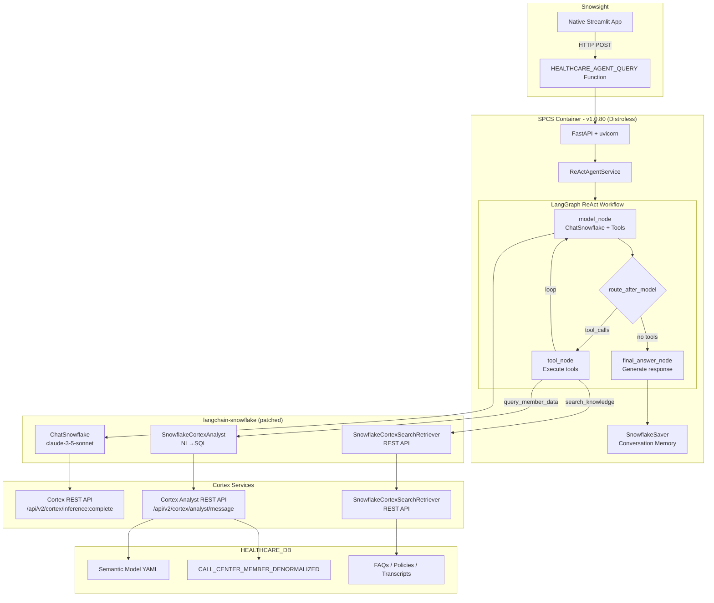

# Healthcare Contact Center ReAct Agent

An AI-powered healthcare contact center assistant built with **ReAct (Reasoning + Acting)** pattern using LangGraph on Snowflake SPCS.

**Current Version:** v1.0.80 | **Architecture:** ReAct Pattern with Full langchain-snowflake Integration | **Image:** 191MB (Distroless)

---

## Executive Summary

### The Challenge

Contact centers are critical for healthcare payers, handling thousands of member inquiries daily. Agents need rapid access to:

- **Structured data**: Claims history, coverage details, member demographics
- **Unstructured knowledge**: Policies, FAQs, procedures, call transcripts
- **Audio context**: Transcribed call recordings for follow-up conversations

Traditional systems require agents to navigate multiple applications, causing delays and inconsistent service.

### The Solution

This lab builds a **production-ready AI assistant** using the **ReAct pattern**:

- **Native tool calling** via `langchain-snowflake` ChatSnowflake (claude-3-5-sonnet)
- **Intelligent tool selection** - automatic tool binding with `llm.bind_tools()`
- **Semantic model** for NL→SQL via `SnowflakeCortexAnalyst` REST API
- **Parallel search** via `SnowflakeCortexSearchRetriever` REST API across FAQs, Policies, and Transcripts
- **Conversation memory** persisted via Snowflake checkpointer
- **Fully async** orchestration via LangGraph with `asyncio.TaskGroup`

All within Snowflake's secure environment using official `langchain-snowflake` integration.

---

## Architecture

### ReAct Workflow



### ReAct Loop Example

```
User Query: "What claims does member 786924904 have, and what's the policy on appeals?"

┌─────────────────────────────────────────────────────────────────────┐
│ ITERATION 1                                                          │
├─────────────────────────────────────────────────────────────────────┤
│ Thought: User wants claims for a specific member AND policy info.    │
│          I should query member data first.                           │
│                                                                      │
│ Action: query_member_data                                            │
│ Action Input: {"query": "claims for member 786924904"}               │
│                                                                      │
│ Observation: Found 4 claims:                                         │
│   - Office Visit: $150 (approved)                                    │
│   - Lab Work: $275 (pending)                                         │
│   - Specialist: $450 (approved)                                      │
│   - Emergency: $1,200 (in review)                                    │
└─────────────────────────────────────────────────────────────────────┘

┌─────────────────────────────────────────────────────────────────────┐
│ ITERATION 2                                                          │
├─────────────────────────────────────────────────────────────────────┤
│ Thought: Now I have the claims. User also asked about appeal policy.│
│          I should search the knowledge base.                         │
│                                                                      │
│ Action: search_knowledge                                             │
│ Action Input: {"query": "claim appeal policy procedure"}             │
│                                                                      │
│ Observation: Found in FAQs:                                          │
│   "Appeals must be filed within 30 days of denial.                   │
│    Submit Form CA-101 with supporting documentation..."              │
└─────────────────────────────────────────────────────────────────────┘

┌─────────────────────────────────────────────────────────────────────┐
│ ITERATION 3                                                          │
├─────────────────────────────────────────────────────────────────────┤
│ Thought: I have both the claims data and appeal policy info.        │
│          I can now provide a complete answer.                        │
│                                                                      │
│ Action: FINAL_ANSWER                                                 │
│ Answer: "Member 786924904 has 4 claims on file:                      │
│          • Office Visit ($150) - Approved                            │
│          • Lab Work ($275) - Pending                                 │
│          • Specialist ($450) - Approved                              │
│          • Emergency ($1,200) - In Review                            │
│                                                                      │
│          Regarding appeals: You have 30 days from denial to file.    │
│          Use Form CA-101 with supporting documentation..."           │
└─────────────────────────────────────────────────────────────────────┘
```

### Database Schema

```
HEALTHCARE_DB
├── MEMBER_SCHEMA
│   ├── MEMBERS (member_id, dob, name, plan_id, status, address, phone) - 242 rows
│   ├── CLAIMS (claim_id, member_id, claim_date, service_type, amount, status) - 632 rows
│   ├── COVERAGE (plan_id, plan_name, deductible, copay_office, copay_er)
│   └── CALL_CENTER_MEMBER_DENORMALIZED (denormalized view for Cortex Analyst) - 632 rows
│
├── KNOWLEDGE_SCHEMA
│   ├── FAQS (faq_id, question, answer, category) - 4 rows
│   ├── POLICIES (policy_id, policy_name, content, version)
│   ├── CALL_TRANSCRIPTS (transcript_id, member_id, transcript_text, summary) - 32 rows
│   └── AUDIO_FILES (audio_id, call_recording_path, duration)
│
├── CHECKPOINT_SCHEMA (LangGraph State Persistence)
│   ├── LANGGRAPH_CHECKPOINTS
│   ├── LANGGRAPH_CHECKPOINT_BLOBS
│   ├── LANGGRAPH_CHECKPOINT_WRITES
│   └── LANGGRAPH_CHECKPOINT_MIGRATIONS
│
├── STAGING
│   ├── SEMANTIC_MODELS (Cortex Analyst semantic model YAML)
│   ├── HEALTHCARE_IMAGES (Docker image repository)
│   └── RAW_DATA (CSVs, PDFs)
│
└── Cortex Search Services
    ├── FAQS_SEARCH (on answer column)
    ├── POLICIES_SEARCH (on content column)
    └── TRANSCRIPTS_SEARCH (on transcript_text column)
```

---

## Project Structure

```
healthcare/
├── src/
│   ├── main.py                          # FastAPI app with lifespan
│   ├── config.py                        # pydantic-settings with SPCS detection
│   ├── dependencies.py                  # @lru_cache + Depends factories
│   ├── routers/
│   │   └── agent_routes.py              # /query, /stream, /sf-query endpoints
│   ├── graphs/
│   │   ├── react_state.py               # HealthcareReActState TypedDict
│   │   ├── react_workflow.py            # ReAct reasoning loop graph
│   │   ├── react_prompts.py             # System prompts + tool descriptions
│   │   └── react_parser.py              # LLM output parsing (orjson + fallbacks)
│   ├── models/
│   │   ├── requests.py                  # QueryRequest (member_id validation)
│   │   ├── responses.py                 # AgentResponse, StreamEvent
│   │   └── agent_types.py               # AnalystResultModel, SearchResultModel
│   ├── tools/
│   │   └── healthcare_tools.py          # @tool decorated functions (query_member_data, search_knowledge)
│   └── services/
│       ├── react_agent_service.py       # AgentService.execute(), .stream()
│       ├── llm_service.py               # ChatSnowflake factory (langchain-snowflake)
│       ├── analyst_service.py           # SnowflakeCortexAnalyst factory
│       ├── search_service.py            # SnowflakeCortexSearchRetriever factory
│       ├── cortex_tools.py              # AsyncCortexAnalystTool, AsyncCortexSearchTool
│       └── snowflake_checkpointer.py    # SQLAlchemy-based LangGraph checkpointer
│
├── scripts/
│   ├── sql/
│   │   ├── 01_setup_db.sql              # Database, schemas, tables
│   │   ├── 02_checkpoint_schema.sql     # LangGraph checkpoint tables
│   │   ├── 03_load_data.sql             # Data loading
│   │   ├── 04_cortex_services.sql       # Cortex Search services
│   │   ├── 05_compute_resources.sql     # Compute pool, warehouse
│   │   ├── 08_spcs_deploy.sql           # SPCS deployment (v1.0.80)
│   │   ├── 09_semantic_model.sql        # Semantic model stage/upload
│   │   └── semantic_models/
│   │       └── healthcare_semantic_model.yaml  # Cortex Analyst NL→SQL model
│   └── streamlit/
│       └── payer_assistant.py           # Streamlit chat interface
│
├── tests/                               # tests
│   ├── conftest.py                      # ReAct-specific fixtures
│   ├── unit/
│   │   ├── test_models.py
│   │   └── test_snowflake_checkpointer.py
│   └── integration/
│       ├── test_agent_service.py
│       └── test_real_snowflake.py
│
├── patches/                             # langchain-snowflake SPCS fixes
│   ├── langchain_snowflake_rest_client_patched.py   # SNOWFLAKE_HOST fix
│   └── langchain_snowflake_tools_patched.py         # content_list parsing fix
│
├── pyproject.toml                       # Dependencies (Python 3.11-3.13)
├── langgraph.json                       # LangGraph config (react_healthcare only)
├── Dockerfile                           # Distroless multi-stage build (191MB)
├── .dockerignore                        # Excludes tests, docs, .venv from build context
└── README.md
```

---

## Features

| Feature | Description |
|---------|-------------|
| **Native Tool Calling** | `ChatSnowflake.bind_tools()` with automatic schema generation |
| **langchain-snowflake** | Full integration with official Snowflake LangChain library |
| **Semantic Model** | NL→SQL via `SnowflakeCortexAnalyst` with verified queries |
| **claude-3-5-sonnet** | Anthropic model with superior tool-calling capabilities |
| **Full Personal Info** | Extracts all member fields (name, DOB, smoker, lifestyle, chronic condition) |
| **Parallel Search** | `asyncio.TaskGroup` searches FAQs, Policies, Transcripts simultaneously |
| **Tool Tracking** | Records all tools used per conversation turn |
| **Conversation Memory** | History persisted via Snowflake checkpointer for multi-turn context |
| **SPCS OAuth** | Automatic `Snowflake Token` authentication via session |
| **Fully Async** | All operations use `async/await` with `asyncio.to_thread()` for blocking calls |

---

## Technology Stack

| Layer | Component | Purpose |
|-------|-----------|---------|
| **Frontend** | Streamlit | Chat interface with session memory |
| **API** | FastAPI + uvicorn | Async HTTP endpoints |
| **Orchestration** | LangGraph | ReAct state graph with checkpointing |
| **LLM Integration** | langchain-snowflake | `ChatSnowflake` + `SnowflakeCortexAnalyst` |
| **Reasoning** | claude-3-5-sonnet | Anthropic model via Cortex REST API |
| **Structured Data** | Cortex Analyst API | NL→SQL via semantic model |
| **Unstructured Data** | Cortex Search | FAQs, policies, call transcripts |
| **Validation** | Pydantic v2 | Request/response models |
| **Deployment** | SPCS | Snowflake Container Services (Distroless) |

---

## Getting Started

### Prerequisites

- Snowflake account with Cortex services enabled
- Python 3.11+ with `uv` package manager
- Key-pair Snowflake authentication configured
- Snow CLI configured (`snow sql -c jwt` works)

### Quick Start

```bash
# Clone and navigate to project
cd /path/to/healthcare

# Install dependencies
uv sync --group dev

# Run SQL setup scripts
snow sql -c jwt --filename scripts/sql/01_setup_db.sql
snow sql -c jwt --filename scripts/sql/02_checkpoint_schema.sql
# ... continue with remaining scripts

# Upload semantic model
snow sql -c jwt --filename scripts/sql/09_semantic_model.sql
# PUT file to @STAGING.SEMANTIC_MODELS

# Start LangGraph dev server
langgraph dev --port 8123

# Run tests (79 tests)
poetry run pytest tests/ -v

# Start FastAPI server locally
uvicorn src.main:app --reload
```

### Environment Variables

Create `.env` file:

```env
SNOWFLAKE_ACCOUNT=your_account
SNOWFLAKE_USER=your_user
SNOWFLAKE_PRIVATE_KEY_PATH=/path/to/rsa_key.p8
SNOWFLAKE_PRIVATE_KEY_PASSPHRASE=your_passphrase
SNOWFLAKE_DATABASE=HEALTHCARE_DB
SNOWFLAKE_WAREHOUSE=PAYERS_CC_WH
SNOWFLAKE_ROLE=ACCOUNTADMIN
```

### SPCS Deployment

```bash
# Build Docker image for linux/amd64 (Distroless - 191MB)
docker buildx build --platform linux/amd64 -t healthcare-agent:1.0.80 .

# Tag and push to Snowflake registry
REGISTRY="your-account.registry.snowflakecomputing.com"
docker tag healthcare-agent:1.0.80 ${REGISTRY}/healthcare_db/staging/healthcare_images/healthcare-agent:1.0.80
snow spcs image-registry login -c jwt
docker push ${REGISTRY}/healthcare_db/staging/healthcare_images/healthcare-agent:1.0.80

# Deploy service
snow sql -c jwt --filename scripts/sql/08_spcs_deploy.sql
```

> **Docker Optimization (66% smaller):**
> - Base: `gcr.io/distroless/python3-debian12` (53MB vs 125MB slim)
> - Multi-stage build with aggressive stripping (no `__pycache__`, tests, docs)
> - Production-only dependencies via `uv sync --only-group spcs-production`

> **langchain-snowflake Patches (applied in Dockerfile):**
> - `rest_client.py`: Uses `SNOWFLAKE_HOST` for correct OAuth authentication in SPCS
> - `tools.py`: Fixes `content_list` parsing to prevent content duplication (issue #35)

### Test SPCS Service

```sql
-- Simple query
SELECT STAGING.HEALTHCARE_AGENT_QUERY('How many members do we have?', NULL, 'test_1');

-- Member-specific query
SELECT STAGING.HEALTHCARE_AGENT_QUERY('Tell me about member 786924904', '786924904', 'test_2');

-- Knowledge search
SELECT STAGING.HEALTHCARE_AGENT_QUERY('What is the policy for prescription coverage?', NULL, 'test_3');
```

---

## References

### Original Lab Resources

- **Snowflake QuickStart Guide**: [AI Agent for Health Payers Contact Center](https://quickstarts.snowflake.com/guide/ai_agent_health_payers_cc/index.html)
- **Video Walkthrough**: [YouTube - Healthcare AI Agent Demo](https://youtu.be/UXge7Vv8uSg?si=aWw2GcnCfWRMVzUE)

### Core Technologies

- [LangGraph Documentation](https://langchain-ai.github.io/langgraph/)
- [langchain-snowflake](https://github.com/langchain-ai/langchain-snowflake) - Official Snowflake LangChain integration
- [Snowflake Cortex Analyst](https://docs.snowflake.com/en/user-guide/snowflake-cortex/cortex-analyst)
- [Snowflake Cortex Search](https://docs.snowflake.com/en/user-guide/snowflake-cortex/cortex-search)
- [Snowflake Container Services (SPCS)](https://docs.snowflake.com/en/developer-guide/snowpark-container-services/overview)

---

## License

MIT License - See LICENSE file for details.
